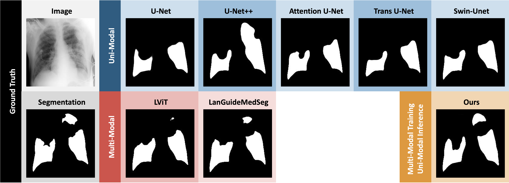
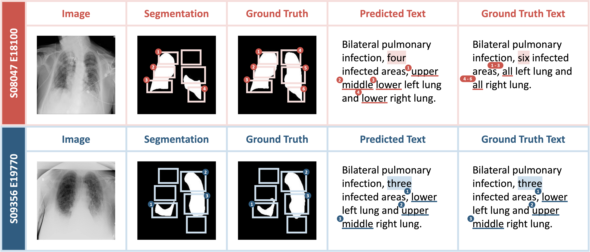
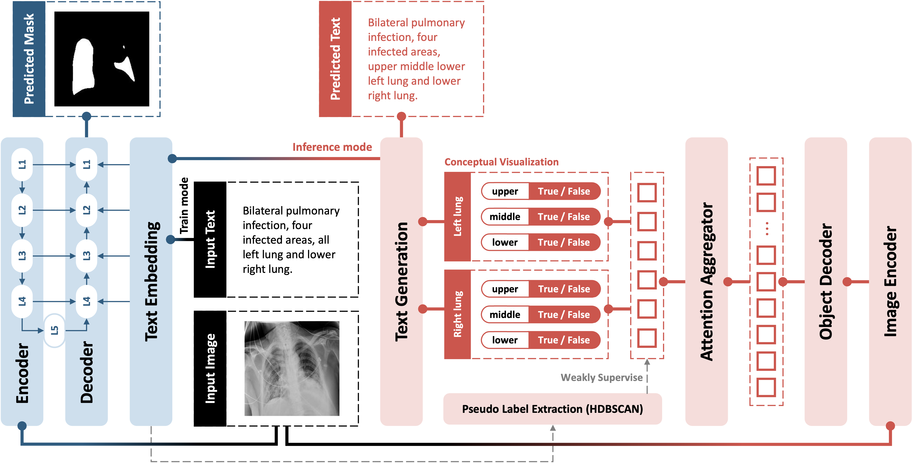

# SGSeg: Enabling Text-free Inference in Language-guided Segmentation of Chest X-rays via Self-guidance
### MICCAI 2024

[](https://shuchangye-bib.github.io/websites/SGSeg/sgseg.html) [](https://arxiv.org/abs/2409.04758) 

[Shuchang Ye](https://shuchangye-bib.github.io), [Mingyuan Meng](https://mungomeng.github.io), [Mingjian Li](https://tzcskys.netlify.app), [Dagan Feng](https://scholar.google.com/citations?user=89py58oAAAAJ), [Jinman Kim](https://www.sydney.edu.au/engineering/about/our-people/academic-staff/jinman-kim.html)




*TL;DR*: The first language-guided segmentation framework enabling text-free inference.



## Contents
<!--ts-->
   * [Framework](#framework)
   * [Requirements](#requirements)
   * [Dataset](#dataset)
   * [Evaluations](#evaluations)
   * [Training](#training)
   * [Pre-trained Weights](#pre-trained-weights)
   * [Acknowledgement](#acknowledgement)
   * [Citation](#citation)
<!--te-->

## Framework



This is a simplified implementation of SGSeg, where the localization-enhanced report generation module is replaced by a classification-based text synthesis module.

## Requirements
The main mandatory dependency versions are as follows:  
```
torch==2.0.1
pytorch_lightning==1.9.0
torchmetrics==1.3.0.post0
transformers==4.24.0
ultralytics==8.1.15
numpy==1.24.3
pandas==2.0.3
pillow==9.4.0
monai==1.0.1
einops==0.7.0
nltk==3.8.1
```
To evaluate the synthesized text:
```
>>> import nltk
>>> nltk.download("wordnet")
```

## Dataset
1. QaTa-COV19 Dataset(images & segmentation mask)  
    QaTa-COV19 Dataset See Kaggle: [https://www.kaggle.com/datasets/aysendegerli/qatacov19-dataset](https://www.kaggle.com/datasets/aysendegerli/qatacov19-dataset)

2. QaTa-COV19 Text Annotations(from thrid party)  
    Check out the related content in LViT: [https://github.com/HUANGLIZI/LViT](https://github.com/HUANGLIZI/LViT)

3. The pre-processed and cleaned version of QaTa dataset is available at ```./data/QaTa```


## Evaluations
To evaluate the performace of our model:
1. Specify the path of the pretrained model in ```checkpoint_path``` parameter in ```config/training.yaml```

2. Run evaluation ```python evaluate.py```

The evaluation would be conducted on the test set. The result would be summarized into 3 tables:
1. Segmentation metrics - ```loss```, ```segmentation accuracy```, ```dice similarity coefficient```, ```MIoU```

2. Detection metrics - ```detection accuracy```, ```detection recall```, ```detection precision```, ```detection f1-score```

3. Text generation metrics - ```BLEU-1```, ```BLEU-2```, ```BLEU-3```, ```BLEU-4```, ```ROUGE```, ```METEOR```

## Training
1. To finetune our pretrain model, specify the path of the pretrained model in ```checkpoint_path``` parameter in ```config/training.yaml```
OR
To train our model from scratch, set the ```checkpoint_path``` parameter in ```config/training.yaml``` to ```None```

2. Customize the following parameters in ```config/training.yaml``` for customized training process:
- ```train_batch_size``` -  the number of samples to be processed in an epoch
- ```image_size``` - tuple of ```(H, W)```
- ```min_epochs``` - minimum epochs of training (unaffected by validation metric)
- ```max_epochs``` - maximum epochs of training
- ```patience``` - the number of epochs to wait before discontinuing the training process if the validation metric has not improved

3. Run ```python train.py```

## Pre-trained Weights (Optional)

1. BERT Model
Download the pre-trained model of CXR-BERT and ConvNeXt
   
   CXR-BERT-specialized see: https://huggingface.co/microsoft/BiomedVLP-CXR-BERT-specialized/tree/main  
   ConvNeXt-tiny see: https://huggingface.co/facebook/convnext-tiny-224/tree/main

   Download the file 'pytorch_model.bin' to './lib/BiomedVLP-CXR-BERT-specialized/' and './lib/convnext-tiny-224'

   Or just use these models online:
   ```
   url = "microsoft/BiomedVLP-CXR-BERT-specialized"
   tokenizer = AutoTokenizer.from_pretrained(url,trust_remote_code=True)
   model = AutoModel.from_pretrained(url, trust_remote_code=True)
   ```
   Please set the ```bert_type``` parameter in ```config/training.yaml``` to the path of the BERT model (default: ```microsoft/BiomedVLP-CXR-BERT-specialized```)

2. RTDETR model
    Download the rtdetr-l model weights from https://github.com/ultralytics/assets/releases/download/v8.1.0/rtdetr-l.pt and place it as follows
    ```
    weights/rtdetr-l.pt
    ```
    Or it would be automatically downloaded when training or evaluating.

## Acknowledgement

We appreciate the [LViT](https://github.com/HUANGLIZI/LViT) for its contributions in integrating language into medical image segmentation and providing annotated descriptive reports. We also thank the [LanGuideMedSeg](https://github.com/Junelin2333/LanGuideMedSeg-MICCAI2023) for the development of a simple yet efficient method for effectively fusing text and images in UNet.


## Citation

```
@InProceedings{10.1007/978-3-031-72111-3_23,
author="Ye, Shuchang
and Meng, Mingyuan
and Li, Mingjian
and Feng, Dagan
and Kim, Jinman",
title="Enabling Text-Free Inference in Language-Guided Segmentation of Chest X-Rays via Self-guidance",
booktitle="Medical Image Computing and Computer Assisted Intervention -- MICCAI 2024",
year="2024",
publisher="Springer Nature Switzerland",
address="Cham",
pages="242--252",
isbn="978-3-031-72111-3"
}
```


